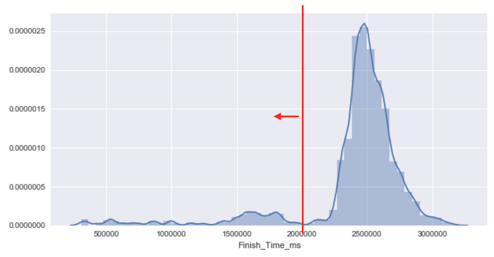
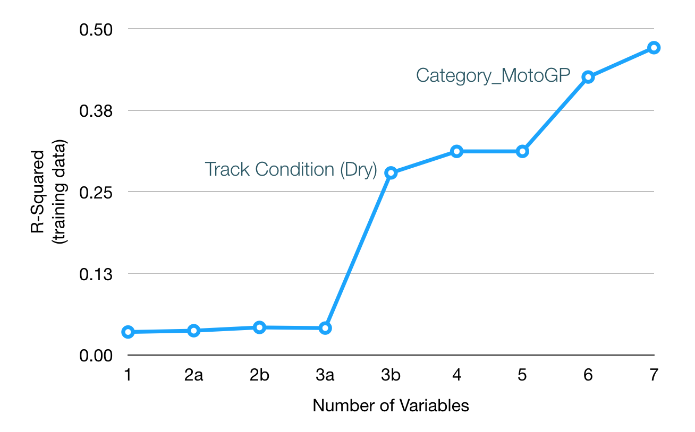

# Predicting MotoGP Race Finish Times Using Linear Regression

Ankur Vishwakarma

Metis SF Winter 2018

---

**Project Goal**

Predict time needed to finish a <a href="[url](https://glorymoto.com/collection/leather-motorcycle-shoes/)">motorcycle</a> race based on (1) physical track characteristics, (2) weather data, and (3) class of racing. There were 28 individual features that fell into the three categories above. 

---

### 1. Scraping

I scraped www.motogp.com for the data using BeautifulSoup and ended up with 19,000+ rows and 30 columns spanning 2005 - 2017.

### 2. Cleaning

After converting the finish time from past races into milliseconds (to get a continuous target value), I plotted the target distribution and discovered it was significantly skewed.

Fortunately, the values on the left of the line represented abnormal races - those that were cut short due to accidents, technical malfunctions, weather conditions, etc. They could be discarded as they were not relevant data points.

### 3. OLS Linear Regression

For the first step, I checked the R-squared value on the training data for a simple OLS linear regression with a variety of different inputs, starting with only 1 feature. The following chart shows the progression of R-squared as I added more features. Called out on the graph are certain features that led to a significant increase in R-squared.

Ultimately, linear regression gave best results with the following parameters:

* Optimized with 16 features
* Test data R-squared = 0.53
* Mean RMSE = 110,698 milliseconds (~2 minutes)

### 4. Polynomial Regression

There was some complexity in the data not being captured by a strictly linear model. Therefore, I added polynomials of 2 and 3-degrees and found that the best fitting model was a polynomial of degree 3. 

| Model Description     | Test Data R-Squared |
| --------------------- | ------------------- |
| OLS                   | 0.53                |
| Lasso regularization  | 0.53                |
| Polynomial (degree 2) | 0.82                |
| Polynomial (degree 3) | 0.95                |

To investigate further, the residual values can be examined via various residual plots (shown below).

1. The first plot shows that the residuals are relatively randomly disributed across predicted value.
2. The middle plot shows that the distribution is fairly normal.
3. The Q-Q plot shows that the distribution of errors is pretty normal except at the lower extreme end. There's still some values this model is not very good at predicting but it works well for the large majority of the data.

### 5. Conclusions

It is possible to predict the race finish time using regression. However, a simple linear regression is too simple of a model to do so. Polynomial features are needed.

Even then, the error is too high for this application as 37 seconds spans 50%+ of the riders’ finishing times. More info on rider characteristics and skill will probably help the model further.
